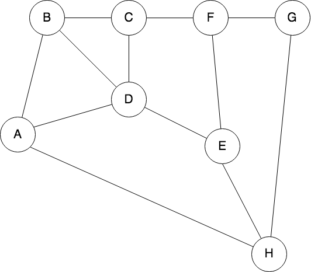

# UndirectedGraph

## Question 1

Use the following undirected graph ­- nodes can be visited only once:

    

        
     

- a. Write a function that returns all the possible paths between A­-H.
- b. Write a function that returns the least number of hops (shortest path) between A­-H.

Steps for setup:
way-1. Use Visual studio code editor for test this code by run option.

way-2. Use Terminal and open the file location and run command as "javac UndirectedGraph.java"
